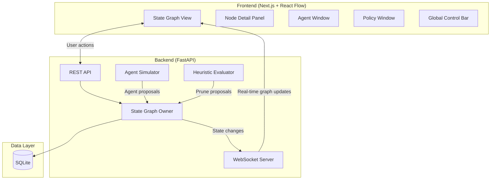

# 🧠 Patch.AI — HackDUCS Hackathon Implementation Plan

> **Formerly:** GraphOS → **Now:** Patch.AI
> **Hackathon:** HackDUCS (Sankalan 2026), Dept. of Computer Science, University of Delhi
> **Deadline:** Round 1 submission by **20 April 2026, 11:59 PM IST** (3 days from now)
> **Domains:** AI/ML, Open Innovation

---

## 📋 Table of Contents

1. [The Big Picture — What Are We Building?](#1-the-big-picture)
2. [Strategic Scoping — What to Build vs. What to Skip](#2-strategic-scoping)
3. [Tech Stack](#3-tech-stack)
4. [Architecture Overview](#4-architecture-overview)
5. [Phase-Wise Development Plan](#5-phase-wise-development-plan)
6. [Demo Script for Judges](#6-demo-script)
7. [PPT Structure (Slide-by-Slide)](#7-ppt-structure)
8. [Round 2 Preparedness](#8-round-2-preparedness)
9. [Deployment & Submission Checklist](#9-deployment--submission-checklist)

---

## 1. The Big Picture

### What is Patch.AI?

**One-liner:** *Patch.AI is the first platform that lets you see, control, and reshape a multi-agent AI system's execution — in real-time — like a surgeon operating on a living process.*

### The Problem (Simple Version)
Today, when you run multiple AI agents together (e.g., one agent writes code, another reviews it, another tests it), you have **zero visibility** into what's happening and **zero ability to intervene** when things go wrong. You either:
- Pre-program rigid checkpoints (LangGraph) — but can't handle unexpected situations
- Let AI agents decide everything autonomously (OpenAI Agents SDK) — but lose all control

### The Solution (Simple Version)
Patch.AI treats the entire execution history of a multi-agent system as a **live, editable graph**. Think of it as **Google Docs for AI orchestration** — you can see every step, edit any step, branch into alternatives, prune dead-ends, and reshape the entire execution flow while it's still running.

### Why "Patch.AI"?
- You **patch** running AI workflows in real-time (like patching code, but for live AI execution)
- You **patch** together multiple agents into orchestrated systems
- You apply **patches** (corrections, branches, policy changes) at any point in the execution

---

## 2. Strategic Scoping

> [!IMPORTANT]
> **The PRD describes a full enterprise product. We have 3 days. We must ruthlessly scope down to a "Minimum Dazzle Product" — the smallest set of features that create maximum WOW for judges.**

### ✅ What We WILL Build (MVP Scope)

| Feature | Why It's In |
|---------|-------------|
| **Live State Graph View** | This IS the product. The visual graph of nodes/edges updating in real-time is the hero feature. |
| **Node Detail Panel** | Click any node → see its artifact, metadata, status. This shows depth. |
| **Node Operations (Prune/Revive/Branch)** | The "surgical intervention" demo is the jaw-dropper. |
| **Agent Window** (simplified) | Show agent status, direct chat. Proves multi-agent concept. |
| **Workflow Policy Window** (simplified) | Show/toggle rules. Proves governance concept without implementing Mode B. |
| **Global Status Bar** | Shows system metrics. Professional polish. |
| **Simulated Multi-Agent Demo Flow** | Pre-scripted agent interactions that produce beautiful graph output. |

### ❌ What We WON'T Build (Deferred)

| Feature | Why It's Out |
|---------|-------------|
| RL-based Evaluator | Heuristic is enough to demo |
| Mode B (LLM policy evolution) | Too complex; Mode A demo is sufficient |
| Export/Snapshot/Resume | Nice-to-have, not demo-critical |
| LangGraph/Claude Code Adapters | Post-hackathon |
| Multi-user collaboration | Post-hackathon |
| Real LLM agent execution | We'll simulate with scripted sequences & mock LLM calls |

### 🎯 The Demo Strategy

> [!TIP]
> **The golden rule: It is 100x better to have 5 features that work flawlessly than 15 features that are buggy.**

We will build a **fully functional interactive UI** backed by a **simulated backend** that replays a realistic multi-agent coding workflow. The simulation will:
1. Show agents (Planner, Coder, Reviewer, Tester) producing work
2. Generate graph nodes in real-time with realistic timing
3. Allow the human to intervene (prune, revive, branch, edit) at any point
4. Respond to interventions with realistic downstream effects

This approach lets us focus all effort on what judges actually see: **a stunning, fluid, interactive interface** that clearly demonstrates the concept.

---

## 3. Tech Stack

```
┌─────────────────────────────────────────────────────┐
│                    FRONTEND                          │
│  Next.js 14 (App Router) + TypeScript               │
│  React Flow (@xyflow/react) — Graph visualization    │
│  Zustand — State management                          │
│  Framer Motion — Animations                          │
│  Socket.io-client — Real-time updates               │
│  Monaco Editor — Code artifact viewing               │
│  Lucide React — Icons                                │
└────────────────────┬────────────────────────────────┘
                     │ WebSocket + REST
┌────────────────────┴────────────────────────────────┐
│                    BACKEND                           │
│  FastAPI (Python) — API server                       │
│  Socket.io (python-socketio) — Real-time events      │
│  Simulated Agent Engine — Mock agent execution       │
│  SQLite — State persistence (lightweight)            │
│  Pydantic — Data validation                          │
└─────────────────────────────────────────────────────┘
```

### Why This Stack?

| Choice | Rationale |
|--------|-----------|
| **Next.js** | Fast setup, excellent DX, easy deployment to Vercel |
| **React Flow** | Purpose-built for interactive node-based graphs; handles 100+ nodes at 60fps |
| **Zustand** | Minimal boilerplate, perfect for high-frequency state updates from WebSocket |
| **FastAPI** | Python-native (AI/ML hackathon context), async-first, fast API development |
| **Socket.io** | Reliable real-time bidirectional communication with auto-reconnect |
| **SQLite** | Zero-config persistence; we don't need a database server |

---

## 4. Architecture Overview



### Data Model (Simplified)

```typescript
// Core Node
interface GraphNode {
  id: string;
  parentId: string | null;
  agent: 'planner' | 'coder' | 'reviewer' | 'tester' | 'human';
  status: 'active' | 'pruned' | 'completed' | 'error';
  artifactType: 'plan' | 'code' | 'review' | 'test_report' | 'decision';
  artifact: string;           // The actual content
  contextDelta: string;       // Only what this node adds
  humanOverride: boolean;
  timestamp: number;
  metadata: Record<string, any>;
}

// Policy Rule
interface PolicyRule {
  id: string;
  text: string;              // Human-readable rule
  type: 'transition' | 'approval' | 'permission';
  enabled: boolean;
  proposer: string;
  timestamp: number;
}
```

---

## 5. Phase-Wise Development Plan

### Timeline Overview (3 Days)

```
Day 1 (April 17-18): Foundation + Core Graph UI
Day 2 (April 18-19): Backend Simulation + Feature Panels  
Day 3 (April 19-20): Polish, Demo Flow, PPT, Deploy
```

---

### Phase 1: Project Setup & Design System (4 hours)

**Goal:** Fully configured project with beautiful design tokens

| Task | Details | Time |
|------|---------|------|
| Initialize Next.js + TypeScript | `npx create-next-app@latest` with App Router | 15 min |
| Install dependencies | React Flow, Zustand, Framer Motion, Socket.io-client, Monaco, Lucide | 15 min |
| Design system CSS | Dark theme, color palette, glassmorphism variables, typography (Inter/JetBrains Mono) | 1.5 hr |
| Layout shell | 3-panel responsive layout (Graph canvas + Right sidebar + Bottom panel) | 1.5 hr |
| Global Control Bar | Status indicators, metrics counters, emergency stop button | 30 min |

**Design Palette:**
```css
/* Dark theme with blue/purple accent — professional, premium feel */
--bg-primary: #0a0e1a;         /* Deep navy background */
--bg-secondary: #111827;       /* Panel backgrounds */
--bg-glass: rgba(17, 24, 39, 0.8);  /* Glassmorphism panels */
--accent-primary: #6366f1;     /* Indigo — primary actions */
--accent-secondary: #8b5cf6;   /* Purple — secondary elements */
--accent-success: #10b981;     /* Emerald — active/success */
--accent-warning: #f59e0b;     /* Amber — warnings */
--accent-danger: #ef4444;      /* Red — prune/error */
--accent-human: #06b6d4;       /* Cyan — human interventions */
--text-primary: #f1f5f9;
--text-secondary: #94a3b8;
--glow-human: 0 0 20px rgba(6, 182, 212, 0.4);  /* Human node glow */
```

---

### Phase 2: State Graph View — The Hero Feature (6 hours)

**Goal:** A stunning, interactive, real-time graph that is the centerpiece of the entire demo

| Task | Details | Time |
|------|---------|------|
| React Flow setup | Canvas with controls, minimap, background grid | 30 min |
| Custom node components | 4 node types: Agent Node, Human Override Node, Decision Node, Error Node | 2 hr |
| Custom edge styles | Animated edges, different styles for different operation types | 45 min |
| Node status animations | Pulse animation for active nodes, fade for pruned, glow for human-modified | 1 hr |
| Zoom/Pan/Fit controls | Smooth animated transitions, fit-to-view on new nodes | 30 min |
| Layout algorithm | Auto-layout (dagre or ELK) for tree/DAG structures | 45 min |
| Right-click context menu | Prune, Revive, Branch, Edit, Inspect — on any node | 30 min |

**Visual Design for Nodes:**
```
┌──────────────────────────┐
│ 🤖 Coder Agent           │  ← Agent icon + name
│ ─────────────────────── │
│ 📄 code: api_handler.py  │  ← Artifact type + name
│ ⏱️ 2 min ago │ ✅ Active  │  ← Timestamp + Status badge
└──────────────────────────┘
   │ Animated dashed edge
   ▼
```

Human override nodes will have a **distinct cyan glow halo** to make them instantly recognizable.

---

### Phase 3: Backend Simulation Engine (5 hours)

**Goal:** A FastAPI backend that simulates realistic multi-agent execution

| Task | Details | Time |
|------|---------|------|
| FastAPI project setup | App structure, CORS, Socket.io integration | 30 min |
| State Graph data model | SQLite schema for nodes, edges, policies, audit log | 45 min |
| SGO (State Graph Owner) | Policy check → Apply operation → Emit WebSocket event | 1.5 hr |
| Agent Simulator | Pre-scripted sequences that produce realistic work output | 1.5 hr |
| Human intervention API | REST endpoints for Prune, Revive, Branch, Edit, Direct Chat | 45 min |

**The Demo Scenario — "Build a REST API"**
The simulation will play out a realistic multi-agent coding task:

```
1. 🧠 Planner → Produces API specification (plan artifact)
2. 💻 Coder → Writes implementation (code artifact)
3. 🔍 Reviewer → Reviews code, finds issues (review artifact)
4. 💻 Coder → Fixes issues (code v2 artifact)
5. 🧪 Tester → Runs tests, some fail (test report artifact)
6. 💻 Coder → Fixes tests (code v3 artifact)
7. 🧪 Tester → All pass (final test report)

MEANWHILE:
- At step 3, Reviewer branches into alternative approach
- At step 5, Evaluator proposes pruning the alternative (it's stalling)
- Human intervenes: revives the pruned branch, redirecting it
```

This scenario demonstrates ALL core features in ~90 seconds of animated demo.

---

### Phase 4: Feature Panels & Interactions (5 hours)

**Goal:** Complete the 5 integrated views with full interactivity

| Task | Details | Time |
|------|---------|------|
| **Node Detail Panel** | Click node → Sidebar with metadata, artifact viewer (Monaco for code), context delta, action buttons | 1.5 hr |
| **Agent Window** | List of 4 agents with status, current node, performance metrics. Click → expanded detail with chat history | 1.5 hr |
| **Policy Window** | List of 6 sample rules with toggle switches, evolution history timeline | 1 hr |
| **Notification System** | Toast notifications for agent proposals, evaluator alerts, status changes | 30 min |
| **Wire everything together** | Zustand store connecting all panels to WebSocket state | 30 min |

---

### Phase 5: Polish, Deploy, Submit (6 hours)

**Goal:** Deployment-ready, demo-polished, submission-complete

| Task | Details | Time |
|------|---------|------|
| Loading screen & onboarding | Animated logo, brief "What is Patch.AI?" overlay | 30 min |
| Responsive polish | Ensure panels don't break on common screen sizes | 30 min |
| Performance optimization | Memoize React Flow nodes, debounce updates | 30 min |
| **"Demo Mode" button** | One-click starts the full simulation — THIS IS CRITICAL for judges | 45 min |
| Landing page | Brief hero section explaining the product (accessible before entering the app) | 1 hr |
| Deploy frontend to Vercel | Connect GitHub repo, configure environment | 30 min |
| Deploy backend to Railway/Render | Deploy FastAPI server, configure WebSocket | 30 min |
| **PPT creation** | 10-12 slides (see Section 7) | 1.5 hr |
| Final testing | Run full demo flow 5 times, fix any issues | 30 min |

---

## 6. Demo Script

> [!TIP]
> **The demo should take exactly 90 seconds and show the "magic" — don't waste time on login screens or settings.**

### The 90-Second Demo

**[0-10s] — Open the App**
- Show the landing page briefly. Click "Launch Dashboard".
- The full Patch.AI interface loads with the empty graph canvas.

**[10-20s] — Start a Task**
- Type in the Global Control Bar: "Build a REST API for a task management system"
- Click "Start Execution"
- 4 agents appear in the Agent Window: Planner, Coder, Reviewer, Tester

**[20-45s] — Watch the Graph Grow**
- Planner produces the first node (API specification)
- Coder starts writing code — nodes animate into the graph
- Reviewer branches into two approaches: "Express.js" and "FastAPI"
- **The graph is growing live with smooth animations — this is the WOW moment**

**[45-60s] — Evaluator Proposes Pruning**
- Evaluator notification pops up: "Branch 'FastAPI approach' is stalling — confidence 72% — Recommend prune"
- The branch flashes with a warning indicator
- Say: "Now here's where Patch.AI is different from everything else..."

**[60-75s] — Human Intervention (The Killer Demo)**
- Click "Override — Keep Branch" on the evaluator proposal
- Right-click a node → "Branch From Here" → create a new exploration path
- Click a node → Node Detail Panel shows the actual code artifact
- Edit the artifact inline → system shows "propagating effects to children"
- **Say: "I just surgically edited a running AI system's output and the system adapted. No other tool can do this."**

**[75-90s] — Show Governance**
- Open Policy Window → toggle a rule ("Branching requires human approval")
- Show the audit log — every operation timestamped and traceable
- **Close: "Patch.AI — real-time human-AI collaboration for multi-agent systems."**

---

## 7. PPT Structure

### Slide-by-Slide Plan (10-12 slides)

| # | Slide Title | Content | Time |
|---|-------------|---------|------|
| 1 | **Title** | Patch.AI logo, tagline: "See. Control. Reshape. Multi-Agent AI in Real-Time." Team names. | 5s |
| 2 | **The Problem** | 3 pain points with icons: No visibility, No control, No audit trail. Stats on multi-agent failures. | 20s |
| 3 | **Current Solutions Fall Short** | 2-column comparison: LangGraph (rigid blueprints) vs. OpenAI Agents (zero control). Show gap in the middle. | 20s |
| 4 | **Introducing Patch.AI** | One-liner + hero screenshot of the live graph view. "Like Google Docs for AI orchestration." | 15s |
| 5 | **How It Works** | Architecture diagram (simplified). State Graph → SGO → Policy Engine → Human Interface. | 20s |
| 6 | **Key Features** | 5 features with icons: Live Graph View, Any-Node Intervention, Mutable Policies, Evaluator System, Full Audit Trail | 20s |
| 7 | **Live Demo** | "Let me show you." → Switch to live demo (90 seconds) | 90s |
| 8 | **Tech Stack** | Clean diagram of stack. Briefly mention: Next.js, React Flow, FastAPI, WebSocket, SQLite. | 10s |
| 9 | **Market Opportunity** | AI orchestration market size. Quote PRD's competitive analysis. "No one does runtime graph mutation." | 15s |
| 10 | **Business Model** | 3 tiers: Developer (Free) → Team ($500/mo) → Enterprise (Custom). Anchored in real market pricing. | 10s |
| 11 | **Roadmap** | Phase 0-3 timeline from PRD. "We're at Phase 0 — core platform is functional." | 10s |
| 12 | **Closing** | "Patch.AI: Because AI systems should be transparent, controllable, and auditable." Links to live demo + GitHub. | 10s |

**Total presentation time: ~4 minutes** (within typical hackathon time limits)

---

## 8. Round 2 Preparedness

> [!WARNING]
> **Round 2 requires implementing a RANDOM feature on-the-spot within a few hours. Our architecture MUST be modular and extensible to handle this.**

### Architecture Decisions for Round 2 Extensibility

1. **Component-based UI**: Every panel is a self-contained React component with its own Zustand slice
2. **API-first backend**: Every operation goes through a REST endpoint — new features just add new endpoints
3. **WebSocket event system**: New events can be added without modifying existing code
4. **Plugin-ready node system**: React Flow custom nodes can be swapped/added easily

### Likely Random Features & How We'd Handle Them

| Possible Feature | Implementation Time | Approach |
|-----------------|--------------------:|----------|
| "Add collaborative editing" | 2 hrs | Add a second cursor to the graph view + basic WebSocket room |
| "Add natural language search" | 1.5 hrs | Search bar → filter nodes by content, add text similarity |
| "Add export to PDF/JSON" | 1 hr | Serialize graph state, use html2canvas for PDF |
| "Add agent performance analytics" | 2 hrs | New panel with charts (Recharts) showing agent metrics |
| "Add voice commands" | 2 hrs | Web Speech API → parse commands → map to existing operations |
| "Add mobile responsiveness" | 1.5 hrs | Responsive CSS, touch-friendly controls |

---

## 9. Deployment & Submission Checklist

### Before Submission (April 20, 11:59 PM IST)

- [ ] **Live demo URL**: Frontend deployed on Vercel, Backend on Railway/Render
- [ ] **GitHub repo**: Clean, well-organized code with README.md
- [ ] **README.md content**:
  - Project description
  - Tech stack
  - Setup instructions (local dev)
  - Architecture diagram
  - Screenshots/GIF of the demo
  - Team members
- [ ] **PPT**: Uploaded to Google Slides (shareable link) or PDF
- [ ] **Demo mode**: The "Start Demo" button works reliably every time
- [ ] **Backup**: Screen recording of the full demo (in case live demo fails)
- [ ] **Test**: Open the live link in incognito mode and verify everything works

### GitHub Repo Structure
```
patch-ai/
├── frontend/          # Next.js app
│   ├── app/           # App router pages
│   ├── components/    # React components
│   │   ├── graph/     # State Graph View
│   │   ├── panels/    # Side panels (Node, Agent, Policy)
│   │   ├── ui/        # Shared UI components
│   │   └── layout/    # Layout shell
│   ├── store/         # Zustand stores
│   ├── lib/           # Utilities, types, constants
│   └── public/        # Static assets
├── backend/           # FastAPI server
│   ├── api/           # REST endpoints
│   ├── core/          # SGO, Policy Engine
│   ├── simulation/    # Agent simulator
│   ├── models/        # Pydantic models
│   └── db/            # SQLite setup
├── docs/              # Documentation
│   ├── PRD.md         # Product Requirements (adapted)
│   └── ARCHITECTURE.md
├── README.md
└── docker-compose.yml # Optional: for easy local setup
```

---

## Open Questions for You

> [!IMPORTANT]
> **Please confirm the following before I start coding:**

1. **Team size & skills**: How many people on your team, and what are their strengths? This affects task distribution.
2. **Deployment accounts**: Do you have accounts on Vercel (frontend) and Railway/Render (backend)? Both have free tiers.
3. **LLM API key**: Do you have an OpenAI/Anthropic/Google API key? We could use it for one or two real LLM calls in the demo (e.g., the "Direct Chat" with an agent), which would make the demo even more impressive. Otherwise, fully simulated is fine.
4. **Should I prioritize building the full app NOW or start with the PPT first?** My recommendation: Build first → PPT on Day 3 (slides are fast once you have screenshots of the working app).
5. **Any specific "domain" angle?** The hackathon lists AI/ML, Web3, Cybersecurity, Social Impact, Open Innovation. Patch.AI naturally fits **AI/ML + Open Innovation**. Should we highlight a specific social impact angle (e.g., "transparency in AI decision-making for regulated industries")?
